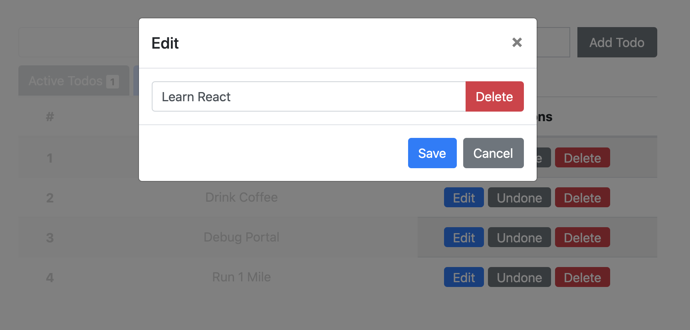
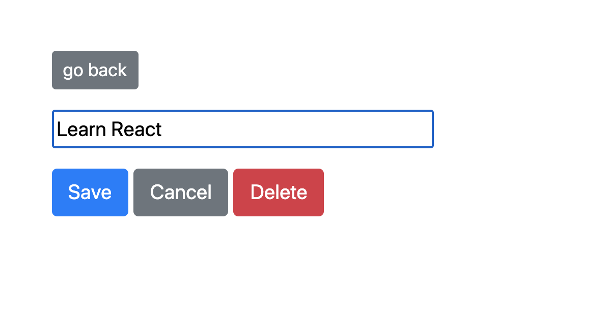

# react-todo - Requirements

## Tasks

- Get todos from https://jsonplaceholder.typicode.com/todos and use it as an initial data - DONE
- While loading data show loading animation. - DONE
- Deploy to heroku - **Individual work**
- Make it persistent (localstorage) - **21 November - Ulan**
- Convert to hooks - **21 November - Ulan**

## Todo UI

## Todo Edit UI

