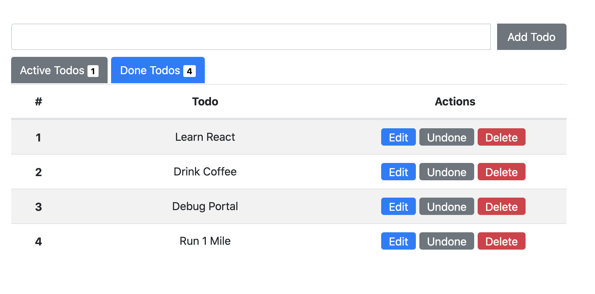

# react-todo - Requirements

## Todo Page

- Add Todo
- Show active/done todos
- Mark as done tasks
- Delete tasks
- Edit button goes to another route

## Todo Edit Page

- go back
- save, cancel, delete => after finishing page goes back to Todo Page

## Todo UI

## Todo Edit UI

######################################################################

# DESING PLAN

App()
Router
state[
isActive: true
]
TodoList()
TodoItem()
edit btn -> routes to Edit() component
done btn -> change state isActive to false

     Edit()
        <Link> </Link>
        go back btn ->history.push(url) (react-router-dom)
        new input content -> change state by callback func to APP()
        delete btn -> callback func, use filter and pass an id to App() and update set

     Addtodo()
